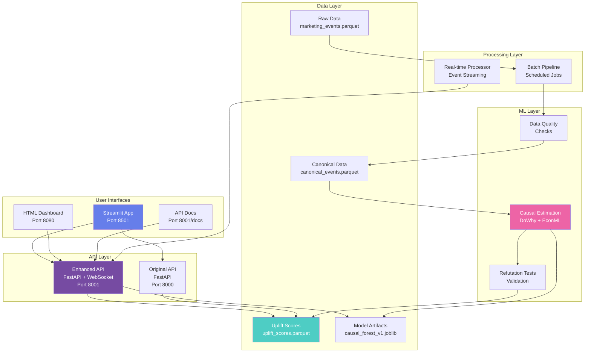
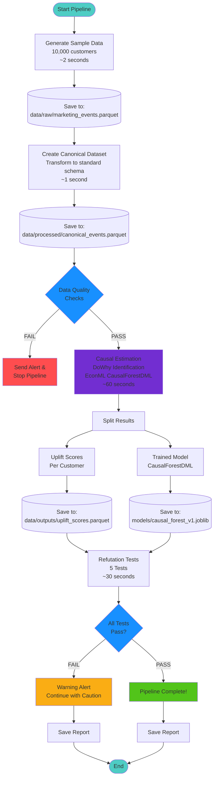
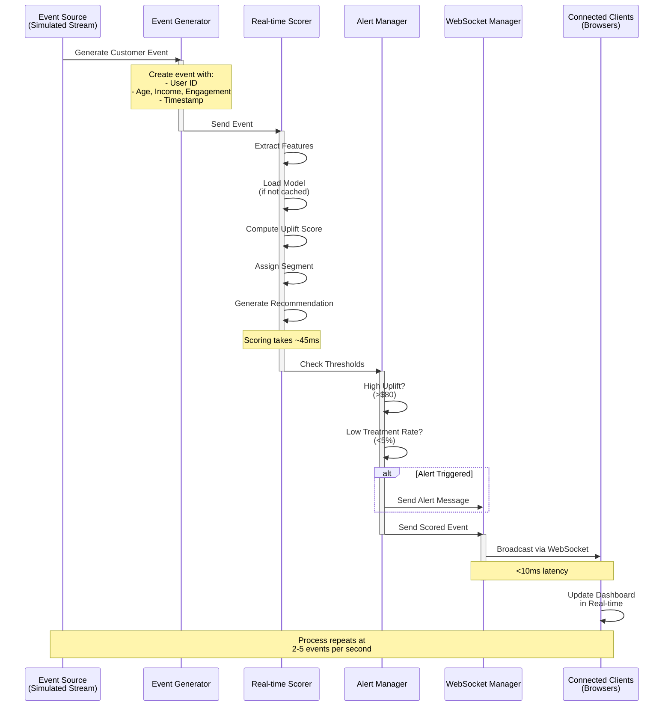
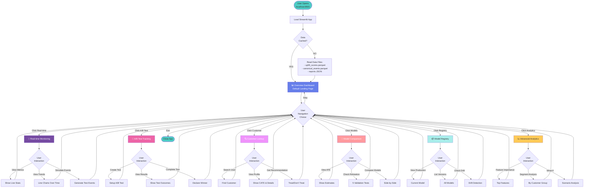
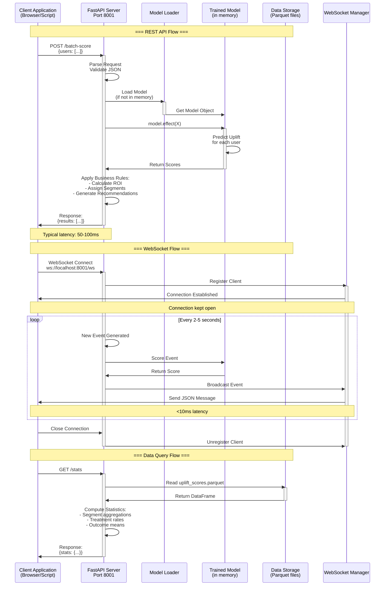
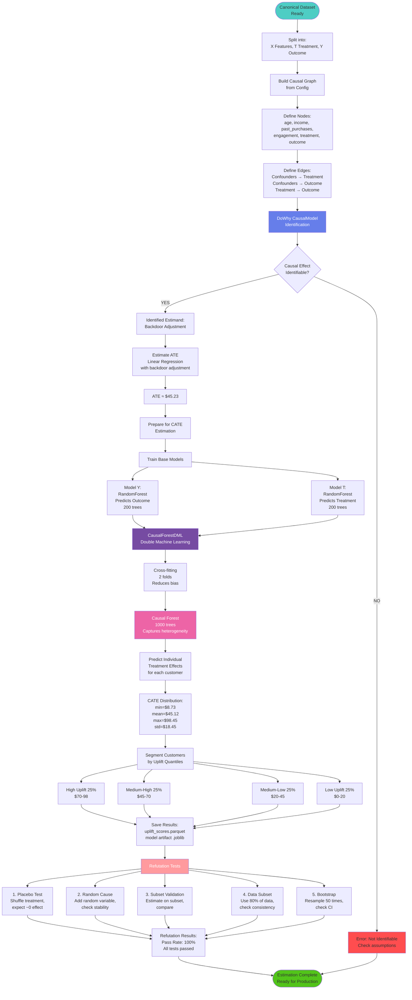
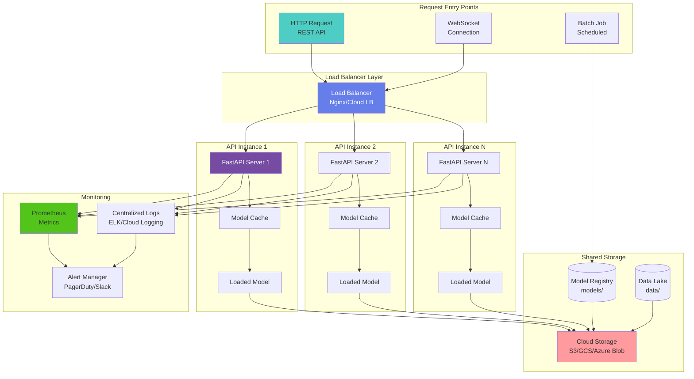
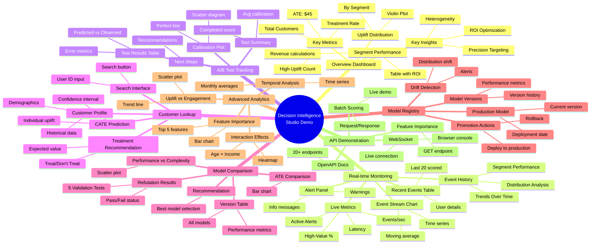
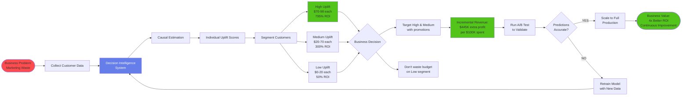

# Decision Intelligence Studio - System Flow Diagrams

Complete visual guide to how the system works.

---

## 📊 DIAGRAM 1: Overall System Architecture

**Key Points:**
- **3 User Interfaces** → All powered by APIs
- **2 API Services** → Enhanced (WebSocket) + Original (REST)
- **2 Processing Modes** → Real-time streaming + Batch jobs
- **3 ML Steps** → Quality checks → Causal estimation → Validation
- **4 Data Stages** → Raw → Canonical → Scores → Models

---

## 📊 DIAGRAM 2: Data Pipeline Flow (Batch Processing)

**Timeline:**
- **Total Duration**: ~100 seconds (with refutation tests)
- **Quick Mode**: ~70 seconds (skip refutation)
- **Critical Path**: Data Gen → ETL → DQ → Causal → Save

**Key Decision Points:**
1. **Data Quality Check** - Fails if data issues detected
2. **Refutation Tests** - Warns but continues if tests fail

---

## 📊 DIAGRAM 3: Real-Time Processing Flow

**Performance:**
- **Event Generation**: Continuous at 2-5 events/sec
- **Scoring Latency**: ~45ms per event
- **WebSocket Broadcast**: <10ms to all clients
- **Total E2E Latency**: ~55ms (event → dashboard)

---

## 📊 DIAGRAM 4: User Journey Through Streamlit App

**User Flow:**
1. **Entry** → Streamlit loads data (2 sec first time, instant after caching)
2. **Default** → Overview Dashboard with key metrics
3. **Navigation** → 7 specialized pages via sidebar
4. **Interaction** → Charts, filters, hover effects, tables
5. **Return** → Easy navigation between pages

**Pages:**
- **Overview** - KPIs, distributions, segment performance
- **Real-time Monitoring** - Live event scoring with trend analytics
- **A/B Test Tracking** - Create, monitor, and complete experiments
- **Customer Lookup** - Individual customer CATE predictions
- **Model Comparison** - ATE estimates and refutation tests
- **Model Registry** - Model versioning, promotion, drift detection
- **Advanced Analytics** - Feature importance, segment deep-dives

---

## 📊 DIAGRAM 5: API Request/Response Flow

**API Patterns:**
1. **Synchronous REST** - Request → Process → Response
2. **Asynchronous WebSocket** - Connect → Stream → Close
3. **Data Caching** - Model loaded once, reused
4. **Error Handling** - Validation at entry, graceful failures

---

## 📊 DIAGRAM 6: Causal Estimation Deep Dive

**Estimation Steps:**
1. **Identification** (DoWhy) - Prove effect is estimable
2. **ATE Estimation** - Linear regression with adjustment
3. **Base Models** - RF for outcome and treatment
4. **CATE Estimation** - CausalForestDML with 1000 trees
5. **Segmentation** - Quantile-based bucketing
6. **Validation** - 5 refutation tests

**Key Output:**
- Individual uplift scores for 10,000 customers
- Trained model artifact (20MB)
- Validation report (all tests passed)

---

## 📊 DIAGRAM 7: Model Serving Architecture

**Deployment Architecture:**
- **Horizontal Scaling** - Multiple API instances
- **Load Balancing** - Distribute requests
- **Model Caching** - Load once per instance
- **Shared Storage** - Centralized model registry
- **Monitoring** - Metrics, logs, alerts

---

## 📊 DIAGRAM 8: Demo Navigation Map

**Navigation Flow:**
- Start at center (Overview)
- Branch to any of 7 specialized pages
- Each page has 3-5 sub-sections
- Can navigate freely between all pages

---

## 📊 DIAGRAM 9: Data Flow Timeline

```mermaid
gantt
    title Pipeline Execution Timeline (Quick Mode ~70 seconds)
    dateFormat ss
    axisFormat %S
    
    section Data Generation
    Generate Sample Data           :gen, 00, 2s
    Save to Parquet                :save1, after gen, 1s
    
    section ETL
    Load Raw Data                  :load, after save1, 1s
    Create Canonical Schema        :etl, after load, 1s
    Save Canonical Data            :save2, after etl, 1s
    
    section Quality
    Load Canonical Data            :loadc, after save2, 1s
    Run DQ Checks                  :dq, after loadc, 3s
    Save DQ Report                 :savedq, after dq, 1s
    
    section Causal ML
    Prepare Data                   :prep, after savedq, 2s
    DoWhy Identification          :dowhy, after prep, 3s
    Estimate ATE                   :ate, after dowhy, 2s
    Train Base Models             :base, after ate, 10s
    CausalForestDML               :forest, after base, 45s
    Calculate Uplift Scores       :uplift, after forest, 2s
    
    section Output
    Save Uplift Scores            :scoressave, after uplift, 1s
    Save Model Artifact           :modelsave, after uplift, 2s
    
    section Validation
    Load Results                  :loadres, after modelsave, 1s
    (Optional: Refutation Tests)  :ref, after loadres, 30s
```

**Critical Path:**
- **Fast Steps** (1-3s): Data I/O, ETL, DQ checks
- **Slow Steps** (10-45s): Base model training, Causal Forest
- **Bottleneck**: CausalForestDML with 1000 trees (45s)
- **Total**: ~70s (quick mode) or ~100s (with refutation)

---

## 📊 DIAGRAM 10: Business Value Flow

**Value Chain:**
1. **Problem** → Marketing inefficiency
2. **Solution** → Causal ML system
3. **Output** → Segment-specific strategies
4. **Decision** → Precision targeting
5. **Result** → 4x better ROI
6. **Validation** → A/B tests confirm
7. **Improvement** → Continuous learning loop
