# Decision Intelligence Studio - System Flow Diagrams

Complete visual guide to how the system works.

---

## 📊 DIAGRAM 1: Overall System Architecture

**Key Points:**
- **3 User Interfaces** → All powered by APIs
- **2 API Services** → Enhanced (WebSocket) + Original (REST)
- **2 Processing Modes** → Real-time streaming + Batch jobs
- **3 ML Steps** → Quality checks → Causal estimation → Validation
- **4 Data Stages** → Raw → Canonical → Scores → Models

---

## 📊 DIAGRAM 2: Data Pipeline Flow (Batch Processing)

**Timeline:**
- **Total Duration**: ~100 seconds (with refutation tests)
- **Quick Mode**: ~70 seconds (skip refutation)
- **Critical Path**: Data Gen → ETL → DQ → Causal → Save

**Key Decision Points:**
1. **Data Quality Check** - Fails if data issues detected
2. **Refutation Tests** - Warns but continues if tests fail

---

## 📊 DIAGRAM 3: Real-Time Processing Flow

**Performance:**
- **Event Generation**: Continuous at 2-5 events/sec
- **Scoring Latency**: ~45ms per event
- **WebSocket Broadcast**: <10ms to all clients
- **Total E2E Latency**: ~55ms (event → dashboard)

---

## 📊 DIAGRAM 4: User Journey Through Streamlit App

```mermaid
flowchart TD
    START([User Opens<br/>localhost:8501]) --> LOAD[Load Streamlit App]
    LOAD --> CACHE{Data<br/>Cached?}
    
    CACHE -->|NO| READ[Read Data Files:<br/>- uplift_scores.parquet<br/>- canonical_events.parquet<br/>- reports JSON]
    CACHE -->|YES| OVERVIEW
    READ --> OVERVIEW
    
    OVERVIEW[📊 Overview Dashboard<br/>Default Landing Page]
    
    OVERVIEW --> NAV{User<br/>Navigation<br/>Choice}
    
    NAV -->|Click Real-time| RT[📡 Real-time Monitoring]
    NAV -->|Click A/B Test| AB[🧪 A/B Test Tracking]
    NAV -->|Click Customer| CUSTOMER[🔍 Customer Lookup]
    NAV -->|Click Models| MODEL[🔬 Model Comparison]
    NAV -->|Click Registry| REGISTRY[📦 Model Registry]
    NAV -->|Click Analytics| ANALYTICS[📈 Advanced Analytics]
    NAV -->|Stay| OVERVIEW
    
    RT --> INTERACT1{User<br/>Interaction}
    AB --> INTERACT2{User<br/>Interaction}
    CUSTOMER --> INTERACT3{User<br/>Interaction}
    MODEL --> INTERACT4{User<br/>Interaction}
    REGISTRY --> INTERACT5{User<br/>Interaction}
    ANALYTICS --> INTERACT6{User<br/>Interaction}
    
    INTERACT1 -->|View Metrics| DISPLAY1[Show Live Stats]
    INTERACT1 -->|View Trends| TRENDS1[Line Charts Over Time]
    INTERACT1 -->|Simulate Events| SIM1[Generate Test Events]
    
    INTERACT2 -->|Create Test| CREATE2[Setup A/B Test]
    INTERACT2 -->|View Results| RESULTS2[Show Test Outcomes]
    INTERACT2 -->|Complete Test| COMPLETE2[Declare Winner]
    
    INTERACT3 -->|Search User| SEARCH3[Find Customer]
    INTERACT3 -->|View Profile| PROFILE3[Show CATE & Details]
    INTERACT3 -->|Get Recommendation| REC3[Treat/Don't Treat]
    
    INTERACT4 -->|View ATE| ATE4[Show Estimates]
    INTERACT4 -->|Check Refutation| REF4[5 Validation Tests]
    INTERACT4 -->|Compare Models| COMPARE4[Side-by-Side]
    
    INTERACT5 -->|View Production| PROD5[Current Model]
    INTERACT5 -->|List Versions| VERSIONS5[All Models]
    INTERACT5 -->|Check Drift| DRIFT5[Drift Detection]
    
    INTERACT6 -->|Feature Importance| IMPORTANCE6[Top Features]
    INTERACT6 -->|Segment Analysis| SEGMENT6[By Customer Group]
    INTERACT6 -->|What-If| WHATIF6[Scenario Analysis]
    
    DISPLAY1 --> NAV
    TRENDS1 --> NAV
    SIM1 --> NAV
    CREATE2 --> NAV
    RESULTS2 --> NAV
    COMPLETE2 --> NAV
    SEARCH3 --> NAV
    PROFILE3 --> NAV
    REC3 --> NAV
    ATE4 --> NAV
    REF4 --> NAV
    COMPARE4 --> NAV
    PROD5 --> NAV
    VERSIONS5 --> NAV
    DRIFT5 --> NAV
    IMPORTANCE6 --> NAV
    SEGMENT6 --> NAV
    WHATIF6 --> NAV
    
    NAV -->|Exit| END([Close App])
    
    style START fill:#4ecdc4
    style OVERVIEW fill:#667eea,color:#fff
    style RT fill:#764ba2,color:#fff
    style AB fill:#ed64a6,color:#fff
    style CUSTOMER fill:#f093fb,color:#fff
    style MODEL fill:#ff9a9e,color:#fff
    style REGISTRY fill:#a8edea,color:#333
    style ANALYTICS fill:#feca57,color:#333
    style END fill:#4ecdc4
```

**User Flow:**
1. **Entry** → Streamlit loads data (2 sec first time, instant after caching)
2. **Default** → Overview Dashboard with key metrics
3. **Navigation** → 7 specialized pages via sidebar
4. **Interaction** → Charts, filters, hover effects, tables
5. **Return** → Easy navigation between pages

**Pages:**
- **Overview** - KPIs, distributions, segment performance
- **Real-time Monitoring** - Live event scoring with trend analytics
- **A/B Test Tracking** - Create, monitor, and complete experiments
- **Customer Lookup** - Individual customer CATE predictions
- **Model Comparison** - ATE estimates and refutation tests
- **Model Registry** - Model versioning, promotion, drift detection
- **Advanced Analytics** - Feature importance, segment deep-dives

---

## 📊 DIAGRAM 5: API Request/Response Flow

**API Patterns:**
1. **Synchronous REST** - Request → Process → Response
2. **Asynchronous WebSocket** - Connect → Stream → Close
3. **Data Caching** - Model loaded once, reused
4. **Error Handling** - Validation at entry, graceful failures

---

## 📊 DIAGRAM 6: Causal Estimation Deep Dive

**Estimation Steps:**
1. **Identification** (DoWhy) - Prove effect is estimable
2. **ATE Estimation** - Linear regression with adjustment
3. **Base Models** - RF for outcome and treatment
4. **CATE Estimation** - CausalForestDML with 1000 trees
5. **Segmentation** - Quantile-based bucketing
6. **Validation** - 5 refutation tests

**Key Output:**
- Individual uplift scores for 10,000 customers
- Trained model artifact (20MB)
- Validation report (all tests passed)

---

## 📊 DIAGRAM 7: Model Serving Architecture

**Deployment Architecture:**
- **Horizontal Scaling** - Multiple API instances
- **Load Balancing** - Distribute requests
- **Model Caching** - Load once per instance
- **Shared Storage** - Centralized model registry
- **Monitoring** - Metrics, logs, alerts

---

## 📊 DIAGRAM 8: Demo Navigation Map

```mermaid
mindmap
  root((Decision Intelligence<br/>Studio Demo))
    Overview Dashboard
      Key Metrics
        ATE: $45
        Total Customers
        Treatment Rate
        High-Uplift Count
      Uplift Distribution
        Violin Plot
        By Segment
      Segment Performance
        Table with ROI
        Revenue calculations
      Key Insights
        Heterogeneity
        ROI Optimization
        Precision Targeting
    Real-time Monitoring
      Live Metrics
        Events/sec
        Latency
        High-Value %
        Active Alerts
      Event Stream Chart
        Moving average
        Time series
      Event History
        Trends Over Time
        Distribution Analysis
        Segment Performance
      Recent Events Table
        Last 20 scored
        User details
      Alert Panel
        Warnings
        Info messages
    A/B Test Tracking
      Test Results Table
        Predicted vs Observed
        Error metrics
      Calibration Plot
        Scatter diagram
        Perfect line
      Test Summary
        Completed count
        Avg calibration
      Next Steps
        Recommendations
    Customer Lookup
      Search Interface
        User ID input
        Search button
      Customer Profile
        Demographics
        Historical data
      CATE Prediction
        Individual uplift
        Confidence interval
      Treatment Recommendation
        Treat/Don't Treat
        Expected value
    Model Comparison
      Version Table
        All models
        Performance metrics
      ATE Comparison
        Bar chart
      Refutation Results
        5 Validation Tests
        Pass/Fail status
      Performance vs Complexity
        Scatter plot
      Recommendation
        Best model selection
    Model Registry
      Production Model
        Current version
        Deployment date
      Model Versions
        Version history
        Performance metrics
      Drift Detection
        Distribution shift
        Alerts
      Promotion Actions
        Deploy to production
        Rollback
    Advanced Analytics
      Feature Importance
        Bar chart
        Top 5 features
      Interaction Effects
        Heatmap
        Age × Income
      Uplift vs Engagement
        Scatter plot
        Trend line
      Temporal Analysis
        Time series
        Monthly averages
    API Demonstration
      OpenAPI Docs
        20+ endpoints
      Batch Scoring
        Live demo
        Request/Response
      Feature Importance
        GET endpoint
      WebSocket
        Browser console
        Live connection
```

**Navigation Flow:**
- Start at center (Overview)
- Branch to any of 7 specialized pages
- Each page has 3-5 sub-sections
- Can navigate freely between all pages

---

## 📊 DIAGRAM 9: Data Flow Timeline

**Critical Path:**
- **Fast Steps** (1-3s): Data I/O, ETL, DQ checks
- **Slow Steps** (10-45s): Base model training, Causal Forest
- **Bottleneck**: CausalForestDML with 1000 trees (45s)
- **Total**: ~70s (quick mode) or ~100s (with refutation)

---

## 📊 DIAGRAM 10: Business Value Flow

**Value Chain:**
1. **Problem** → Marketing inefficiency
2. **Solution** → Causal ML system
3. **Output** → Segment-specific strategies
4. **Decision** → Precision targeting
5. **Result** → 4x better ROI
6. **Validation** → A/B tests confirm
7. **Improvement** → Continuous learning loop
